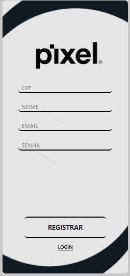
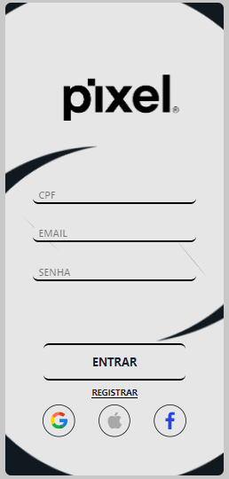
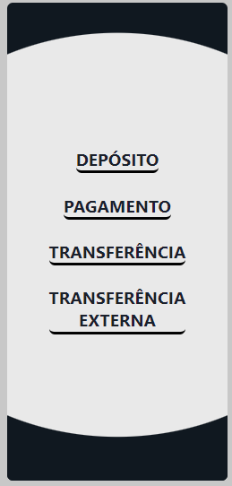
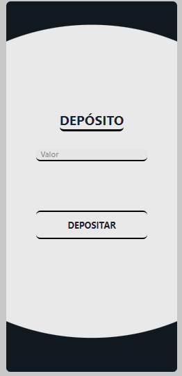
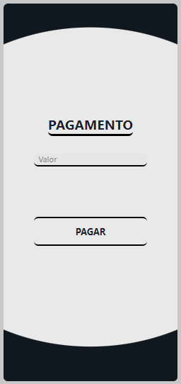
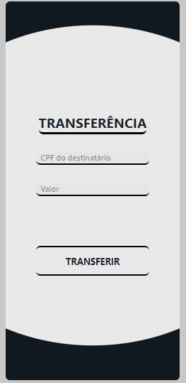
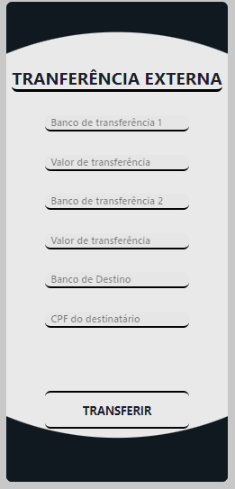

<br>

<div id="pt">

<h1 align="center"> Sumário 📖 </h1>
<div id="sumario" style="display: inline_block" align="center">
	<a href="#intro"> Introdução  </a> |
	<a href="#conceitos"> Conceitos & Metodologia </a> |
	<a href="#docker"> Docker </a> |
	<a href="#conclusao"> Conclusão </a>
</div>
<br>

<div id="intro">

# Introdução 🎉

Os avanços na tecnologia e a crescente popularidade dos dispositivos móveis mudaram drasticamente a maneira como os clientes interagem com os serviços bancários. No Brasil, o lançamento do Pix revolucionou o negócio financeiro, proporcionando uma solução flexível, segura e inclusiva para pagamentos, depósitos e transferências de valores. Desde sua implantação, o Pix trouxe benefícios significativos para a vida dos brasileiros, sendo uma alternativa eficaz aos meios de pagamento tradicionais.

Diante dessa situação, o governo de um país sem banco central tem interesse em desenvolver um sistema semelhante ao Pix no Brasil. O objetivo é criar uma solução que permita a criação de contas bancárias para que os clientes possam realizar transações financeiras de forma distribuída, possibilitando pagamentos, depósitos e transferências entre diferentes contas bancárias sem a necessidade de uma entidade central.

Em resposta a esta necessidade, foi desenvolvido um protótipo de solução para este desafio. Neste projeto, exploraremos métricas e requisitos fundamentais para o desenvolvimento de sistemas distribuídos, com foco em questões como comunicação segura entre servidores bancários, transações atômicas garantidas e proteção contra movimentação de valores inexistentes ou gastos duplos.

Este relatório apresentará as soluções propostas e as tecnologias utilizadas para implementar os sistemas distribuídos exigidos pelos países relevantes. Além disso, analisaremos os desafios enfrentados e as estratégias adotadas para garantir a segurança e a confiabilidade das transações financeiras. Por fim, avaliaremos o potencial dessa solução distribuída para atender as necessidades e objetivos do país, permitindo o desenvolvimento de um sistema semelhante ao Pix no Brasil mesmo sem um banco central.

</div>

<div id="conceitos">

# Conceitos & Metodologia 📚

	
A metodologia adotada para o desenvolvimento do sistema de pagamentos distribuídos, baseado nos códigos fornecidos, segue uma abordagem orientada a microsserviços, onde cada componente desempenha uma função específica. A aplicação é dividida em duas partes principais: o componente Bank e o componente PaxosWithVectorClocks.

O componente Bank representa a API de um banco e é responsável por oferecer os serviços financeiros, como transferências, pagamentos e depósitos. Cada instância do Bank é tratada como um banco independente no sistema distribuído. Essa abordagem permite a escalabilidade horizontal do sistema, onde novas instâncias do Bank podem ser adicionadas conforme a demanda aumenta.

Por outro lado, o componente PaxosWithVectorClocks implementa o algoritmo de Paxos, combinado com relógios vetoriais, para garantir o consenso entre os bancos no sistema distribuído. O algoritmo de Paxos permite que os bancos cheguem a um acordo sobre os valores propostos em cada transação, mesmo em situações de falhas ou atrasos na comunicação. Os relógios vetoriais são utilizados para manter a consistência e a ordem das transações, registrando o conhecimento local do tempo em relação aos outros bancos.

A interação entre os componentes ocorre por meio de troca de mensagens. O Bank se comunica com outros bancos por meio de requisições e respostas HTTP, permitindo a realização de transações e a manutenção da consistência dos saldos das contas. O componente PaxosWithVectorClocks é responsável por enviar mensagens de preparação (prepare) e aceitação (accept) entre os bancos, a fim de chegar a um consenso sobre os valores propostos. Além disso, o aprendizado (learn) é utilizado para disseminar o valor aceito para os demais bancos.

A arquitetura do sistema permite que cada banco (instância do Bank) seja tratado como um componente independente, possibilitando o desenvolvimento e teste individual de cada banco. Essa abordagem facilita a manutenção e aprimoramento do sistema como um todo, além de proporcionar uma escalabilidade eficiente em termos de adição de novos bancos.

No contexto do sistema distribuído de pagamentos, o frontend foi implementado para fornecer uma interface amigável aos usuários, permitindo a visualização de informações relevantes, como saldos de contas, e outras funcionalidades relacionadas aos serviços financeiros.

<lu>
    <li><a href="#bank">Bank</a></li>
    <li><a href="#paxos">Paxos</a></li>
	<li><a href="#front">Frontend</a></li>
</lu>
</div>

<br>

<div id="bank">  
  
# Bank 🏦
Este é um arquivo em Python que implementa um serviço de banco usando o framework Flask. O serviço fornece funcionalidades relacionadas a transações bancárias, registro de usuários e verificação de saldo.

# Funcionalidades 🚀
O serviço de banco possui as seguintes funcionalidades:

Verificar saldo da conta
Verificar se um saldo é válido para uma transação
Registrar um novo usuário
Realizar autenticação de usuário
Realizar transações entre contas do mesmo banco
Realizar transações entre bancos diferentes

# Bibliotecas utilizadas 📚
 - Flask: Framework utilizado para criar o serviço web
 - flask_cors: Utilizado para lidar com a política de mesma origem (CORS) no Flask
 - json: Utilizado para trabalhar com dados JSON
 - threading: Utilizado para criar threads e lidar com bloqueio
 - requests: Utilizado para enviar solicitações HTTP para outros serviços/bancos
 - time: Utilizado para pausar a execução do programa

# Como executar 🛠️
1. Certifique-se de ter o Python instalado.
2. Instale as bibliotecas necessárias executando o seguinte comando no terminal:

```console
pip install flask flask_cors
```

3. Execute o arquivo bank.py através do terminal com o comando:

```console
python bank.py
```
O serviço de banco estará em execução na porta especificada.
Você pode optar também por rodar a imagem docker que já estar configurada.

# Como usar 📝
## Verificar saldo da conta
Endpoint: /balance

Método: POST

Parâmetros:

cpf: CPF do titular da conta
Exemplo de solicitação:

```json
{
  "cpf": "12345678910"
}
```
Exemplo de resposta:

```json
{
  "balance": 1000
}
```

## Verificar se um saldo é válido para uma transação

Endpoint: /balanceValid

Método: POST

Parâmetros:

cpf: CPF do titular da conta
value: Valor a ser verificado
Exemplo de solicitação:

```json
{
  "cpf": "12345678910",
  "value": 500
}
```

Exemplo de resposta:

```json

{
  "success": true
}
```
## Registrar um novo usuário
Endpoint: /registerUser

Método: POST

Parâmetros:

cpf: CPF do titular da conta
type: Tipo de conta (ex: individual, conjunta)
name1: Nome do titular
email1: E-mail do titular
password1: Senha do titular
name2: Nome do segundo titular (opcional)
email2: E-mail do segundo titular (opcional)
password2: Senha do segundo titular (opcional)
Exemplo de solicitação:

```json

{
  "cpf": "12345678910",
  "type": "conjunta",
  "name1": "João",
  "email1": "joao@example.com",
  "password1": "senha123",
  "name2": "Maria",
  "email2": "maria@example.com",
  "password2": "senha456"
}
```
Exemplo de resposta:

```json

{
  "success": true
}
```
## Realizar autenticação de usuário
Endpoint: /signIn

Método: POST

Parâmetros:

cpf: CPF do titular da conta
email: E-mail do titular
password: Senha do titular
Exemplo de solicitação:

```json
{
  "cpf": "12345678910",
  "email": "joao@example.com",
  "password": "senha123"
}
```
Exemplo de resposta (sucesso):

```json
{
  "success": true
}
```
Exemplo de resposta (falha):

```json
{
  "success": false
}
```
## Realizar transações entre contas do mesmo banco
Endpoint: /transactionIn

Método: POST

Parâmetros:

cpf: CPF do titular da conta de origem
cpfRec: CPF do titular da conta de destino
value: Valor a ser transferido
Exemplo de solicitação:

```json

{
  "cpf": "12345678910",
  "cpfRec": "10987654321",
  "value": 500
}
```
Exemplo de resposta (sucesso):

```json

{
  "success": true
}
```
Exemplo de resposta (falha - saldo insuficiente):

```json

{
  "success": false,
  "error": "value insufficient"
}
```
## Realizar transações entre bancos diferentes
Endpoint: /transactionEx

Método: POST

Parâmetros:

cpf: CPF do titular da conta de origem
destiny: Banco de destino ("bankA", "bankB", "bankC")
banks: Lista contendo as informações das contas de destino
bank: Banco de destino ("bankA", "bankB", "bankC")
cpf: CPF do titular da conta de destino
value: Valor a ser transferido para a conta de destino
Exemplo de solicitação:

```json

{
  "cpf": "12345678910",
  "destiny": "bankA",
  "banks": [
    [
       "bankA",
       "10987654321",
       300
    ],
    [
      "bankB",
      "98765432109",
       200
    ]
  ]
}
```
Exemplo de resposta (sucesso):

```json

{
  "success": true
}
```
Exemplo de resposta (falha - saldo insuficiente):

```json

{
  "success": false,
  "error": "value insufficient"
}
```
## Realizar um depósito na conta
Endpoint: /deposit

Método: POST

Parâmetros:

cpf: CPF do titular da conta
value: Valor a ser depositado
Exemplo de solicitação:

```json

{
  "cpf": "12345678910",
  "value": 200
}
```
Exemplo de resposta:

```json

{
  "success": true
}
```
## Realizar um pagamento
Endpoint: /payment

Método: POST

Parâmetros:

cpf: CPF do titular da conta
value: Valor a ser pago
Exemplo de solicitação:

```json

{
  "cpf": "12345678910",
  "value": 100
}
```
Exemplo de resposta (sucesso):

```json

{
  "success": true
}
```
Exemplo de resposta (falha - saldo insuficiente):

```json

{
  "success": false,
  "error": "value insufficient"
}
```
	
</div>

<div id="paxos">

# PaxosWithVectorClocks ⏰
O código PaxosWithVectorClocks implementa um algoritmo de consenso chamado Paxos com relógios vetoriais. Ele é usado para garantir a consistência em sistemas distribuídos, permitindo que os processos concordem em um valor comum, mesmo em face de falhas e latência na comunicação entre os processos.

# Funcionalidades 🚀
O código possui as seguintes funcionalidades:

- Propor um valor para o consenso.
- Adicionar um novo processo ao sistema.
- Enviar mensagens entre os processos.
- Preparar a proposta e obter respostas de promessas dos demais processos.
- Aceitar uma proposta e obter respostas de aceitação dos demais processos.
- Aprender o valor aceito pelo consenso.

### Método propose(process_id, value)
Este método é usado para propor um valor ao sistema. Ele recebe como entrada o ID do processo proponente e o valor a ser proposto. O algoritmo utiliza uma abordagem de tentativa e erro, onde gera um número de proposta e tenta alcançar um consenso por meio das fases de preparação e aceitação. O método retorna o valor aceito pelo consenso ou None se não houver consenso alcançado após um número máximo de tentativas.

### Método add_process(process_id)
Este método é utilizado para adicionar um novo processo ao sistema. Ele recebe como entrada o ID do novo processo a ser adicionado.

### Método send_message(sender_id, receiver_id, message)
Este método é utilizado para enviar uma mensagem de um processo remetente para um processo destinatário. Ele recebe o ID do processo remetente, o ID do processo destinatário e a mensagem a ser enviada.

### Método prepare(proposal_number)
Este método é responsável pela fase de preparação do algoritmo Paxos. Ele gera uma mensagem de preparação com o número de proposta atual e o relógio vetorial atual, e envia essa mensagem para todos os outros processos. Em seguida, aguarda as respostas de promessa dos demais processos. Se receber promessas suficientes, atualiza o relógio vetorial com os valores máximos recebidos e retorna True. Caso contrário, retorna False.

### Método accept(proposal_number, value)
Este método é responsável pela fase de aceitação do algoritmo Paxos. Ele gera uma mensagem de aceitação com o número de proposta e o valor a ser aceito, e envia essa mensagem para todos os outros processos. Em seguida, aguarda as respostas de aceitação dos demais processos. Se receber aceitações suficientes, atualiza o relógio vetorial com os valores máximos recebidos e retorna o valor aceito pelo consenso. Caso contrário, retorna None.

### Método learn(accepted_value)
Este método é chamado quando um valor é aceito pelo consenso. Ele atualiza o valor aceito no objeto PaxosWithVectorClocks e envia uma mensagem de aprendizado para os demais processos, informando o valor aceito.


</div>
	


<div id="front">

# Frontend 👨‍💻

O frontend do projeto consiste em uma aplicação web desenvolvida utilizando a biblioteca React, combinada com o framework de estilização Tailwind CSS e a biblioteca de componentes Chakra UI. O objetivo principal desse frontend é fornecer uma interface intuitiva e responsiva para os usuários interagirem com as funcionalidades relacionadas a transações bancárias.

## Funcionalidades 🚀

O frontend é composto por sete páginas principais, cada uma com sua respectiva finalidade:

- Login: Página de autenticação, onde os usuários podem realizar o login em suas contas bancárias.
- SignUp: Página de cadastro, onde novos usuários podem criar uma conta bancária.
- Home: Página inicial após o login, que exibe informações resumidas da conta do usuário e oferece acesso rápido às demais funcionalidades.
- Deposit: Página para realizar depósitos em conta, permitindo que os usuários insiram valores e efetuem a transação.
- Payment: Página para realizar pagamentos, onde os usuários podem inserir os dados do destinatário e o valor a ser transferido.
- TransEx: Página de transferências externas, que possibilita aos usuários realizar transferências para contas de outros bancos.
- TransIn: Página de transferências internas, permitindo que os usuários realizem transferências entre contas do mesmo banco.

## Bibliotecas utilizadas 📚

Para facilitar o desenvolvimento e melhorar a experiência do usuário, foram utilizadas as seguintes bibliotecas:

- React: Uma biblioteca JavaScript popular para a criação de interfaces de usuário interativas e reativas.
- Tailwind CSS: Um framework de estilização que utiliza classes utilitárias para facilitar a construção de interfaces responsivas e customizáveis.
- Chakra UI: Uma biblioteca de componentes para React que fornece uma ampla variedade de elementos de interface prontos para uso, seguindo boas práticas de design e acessibilidade.

## Como executar 🛠️

Para executar o frontend, é necessário ter o Node.js instalado na máquina.

1. Acesse a pasta do frontend no terminal.
2. Execute o comando npm install para instalar as dependências.
3. Execute o comando npm run dev para iniciar o servidor local.
4. Acesse a URL http://localhost:5173/ no navegador para visualizar o frontend.

# Considerações Finais
O frontend do projeto foi desenvolvido com o intuito de oferecer uma experiência agradável e eficiente para os usuários que desejam realizar transações bancárias de forma prática e segura. A combinação das tecnologias React, Tailwind CSS e Chakra UI permite a criação de interfaces modernas e responsivas, além de facilitar o desenvolvimento e a manutenção do código.

<div id="tela1" style="display: block; text-align: center;">
    
    <p>Tela de Cadastro</p>
</div>

<div id="tela2" style="display: block; text-align: center;">
    
    <p>Tela de Login</p>
</div>

<div id="tela3" style="display: block; text-align: center;">
    
    <p>Tela de Home</p>
</div>

<div id="tela4" style="display: block; text-align: center;">
    
    <p>Tela de Depósito</p>
</div>

<div id="tela5" style="display: block; text-align: center;">
    
    <p>Tela de Pagamento</p>
</div>

<div id="tela6" style="display: block; text-align: center;">
    
    <p>Tela de Transação Interna</p>
</div>

<div id="tela7" style="display: block; text-align: center;">
    
    <p>Tela de Transação Externa</p>
</div>


</div>

<div id="docker">

# Docker 🐳

Para gerar as imagens das aplicações em Python (Car, Fog e Gas Station), existem arquivos Dockerfile prontos para serem utilizados. Esses arquivos contêm as instruções necessárias para gerar as imagens da aplicação, incluindo as dependências, configurações e arquivos necessários para que a aplicação seja executada.

Resumidamente você irá precisar executar dois comandos: `docker build` e `docker run`.

Por exemplo, suponha que você tem um arquivo Dockerfile na raiz do projeto do servidor (o que é o caso) em Python com o nome Dockerfile.server e quer gerar a imagem com o nome meu-servidor. Para criar a imagem, execute o seguinte comando no terminal, dentro da pasta raiz do projeto:

```console
docker build -t meu-servidor -f Dockerfile.server .
```

Nesse comando, o parâmetro -t é utilizado para definir o nome da imagem que será gerada e o parâmetro -f é utilizado para especificar o arquivo Dockerfile a ser utilizado. O ponto no final indica que o contexto para a construção da imagem é a pasta atual.

Após a criação da imagem, ela pode ser executada com o comando docker run. É possível definir as portas que a aplicação utilizará e outras configurações através de parâmetros nesse comando. Por exemplo:

```console
docker run -p 1883:1883 meu-servidor
```

Nesse comando, o parâmetro -p é utilizado para definir a porta da máquina host que será redirecionada para a porta da aplicação dentro do container. O primeiro valor é a porta da máquina host e o segundo valor é a porta da aplicação dentro do container.

Caso queira compartilhar a imagem gerada em um repositório Docker, basta fazer o push dessa imagem com o comando docker push passando o nome da imagem e a tag correspondente. Por exemplo:

```console
docker push meu-repositorio/meu-servidor:1.0
```
Nesse comando, o nome meu-repositorio é o nome do seu repositório no Docker Hub e a tag 1.0 é a versão da imagem que está sendo enviada.

Com esses comandos, é possível gerar e executar as imagens das aplicações em Python com o Docker.

</div>

<div id ="conclusao">

# Conclusão 🏁


Neste projeto, desenvolvemos uma solução que consiste em um frontend em React com Tailwind CSS, responsável por proporcionar uma interface amigável e intuitiva para os usuários, com 7 páginas distintas: Login, SignUp, Home, Deposit, Payment, TransEx e TransIn. Através dessas páginas, os usuários podem se conectar à API dos bancos e realizar as transações financeiras necessárias, como pagamentos, depósitos e transferências.

Para garantir a comunicação eficiente entre o frontend e a API, utilizamos a biblioteca Axios, que simplifica as requisições HTTP. Além disso, para aprimorar a interface do usuário, integramos a biblioteca Chakra UI, que fornece componentes estilizados e personalizáveis para uma experiência visual mais agradável.

No que diz respeito ao backend, o projeto conta com a implementação dos componentes "paxos" e "bank". O componente "paxos" é responsável por implementar o protocolo de consenso Paxos, garantindo que os servidores cheguem a um acordo sobre os valores propostos, mesmo em situações de falhas ou atrasos na comunicação. Já o componente "bank" lida com as operações bancárias, como pagamentos, depósitos e transferências entre contas bancárias. Essa implementação visa garantir a consistência e a integridade das transações financeiras distribuídas.

Outro aspecto importante do projeto é a sua containerização utilizando o Docker. Essa abordagem permite empacotar o frontend, o backend e todas as dependências em contêineres isolados, garantindo a portabilidade e a escalabilidade da solução. Com o Docker, é possível implantar e executar o sistema em diferentes ambientes de forma consistente e eficiente.

Em conclusão, o projeto foi bem-sucedido ao fornecer uma solução funcional e eficiente para a realização de transações financeiras distribuídas. O frontend em React, combinado com o Tailwind CSS e a biblioteca Chakra UI, proporciona uma interface amigável e intuitiva para os usuários. A integração do Axios com a API dos bancos permite a comunicação eficiente entre o frontend e o backend. Além disso, a implementação dos componentes "paxos" e "bank" assegura a consistência e a integridade das transações financeiras. A containerização do projeto utilizando o Docker adiciona portabilidade e escalabilidade, facilitando sua implantação em diferentes ambientes.
</div>

</div>
